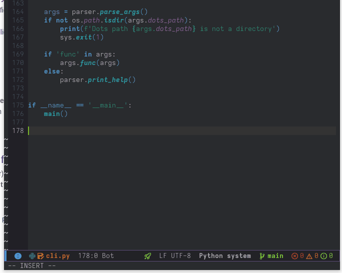

# Emacs Gitlab-LSP client for lsp-mode

Gitlab Duo Code Assistant completions via [Gitlab LSP](https://gitlab.com/gitlab-org/editor-extensions/gitlab-lsp)



## Installing

### Via Use-Package

<details>

``` elisp
(use-package gitlab-lsp
  :quelpa (gitlab-lsp :fetcher github
                      :repo "kassick/gitlab-lsp.el"
                      :branch "main"
                      :files ("*.el"))
  :config

  ;; speed up completions
  (setq gitlab-lsp-show-completions-with-other-clients nil)

  (add-hook 'gitlab-lsp-complete-before-complete-hook
            (lambda ()
              ;; scroll to top so preview can show the snippet
              (recenter-top-bottom 4)

              ;; Show something, since we can not spin ...
              (message "Asking for suggestions ...")))

  (define-key global-map
              (kbd "C-*") '("Complete with Gitlab Duo" . gitlab-lsp-complete))
)
```

</details>

### Spacemacs

<details>

```elisp

;; In dotspacemacs/layers:

(setq-default
 ;; ...
 dotspacemacs-additional-packages
 '(
   ;; ...
   (gitlab-lsp :location (recipe
                          :fetcher github
                          :repo "kassick/gitlab-lsp.el"
                          :files ("*.el")))
   ;; ...
   )
 ;; ...
 )


;; In dotspacemacs/user-config:

(require 'gitlab-lsp)

;; speed up completions
(setq gitlab-lsp-show-completions-with-other-clients nil)

;; Scroll the buffer so we have more space for company preview frontend
(add-hook 'gitlab-lsp-complete-before-complete-hook
          (lambda ()
            ;; scroll to top so preview can show the snippet
            (recenter-top-bottom 4)

            ;; Show something, since we can not spin ...
            (message "Asking for suggestions ...")))

(define-key global-map
            (kbd "C-*") '("Complete with Gitlab Duo" . gitlab-lsp-complete))
```

</details>


## Setup

### Install the LSP Server

Run `lsp-install-server <RET> gitlab-lsp` to have `lsp-mode` download and install the server for you.

You can also manually install the server anywhere in your `$PATH` or adjust `gitlab-lsp-executable` to have `lsp-mode` use the external command.

### Generate an Access Token

You must generate either a _Personal Access Token_ or an _OAuth Token_ to access your gitlab instance. The token must have the `api` scope.

### Configure the LSP Client

-   **Option 1: Secrets (GNOME Keyring or KDE Wallet)**: Simply open a file (of one of the supported modes) and you will be prompted for the Gitlab instance _URL_ and _token_.

    You can also `M-x gitlab-lsp-setup` at any time to create or update the token and URL.

-   **Option 2: Emacs Custom Variables**: You can `M-x customize-group <RET> gitlab-lsp` and adjust the values of `gitlab-lsp-server-url` and `gitlab-lsp-token`.

-   **Option 3**: You may set the environment variables `GITLAB_LSP_BASE_URL` and `GITLAB_LSP_TOKEN` and the client will pick them up.

By default, `gitlab-lsp` will try to find the values in the environment variables, then custom variables, and finally secrets.

If you have your URL and token stored via secrets and then either `(setenv "GITLAB_LSP_BASE_URL" "https://localhost:8080")` or `(setq gitlab-lsp-server-url "https://localhost:8080")`, then the client will use the URL from the environment and the token from secrets.

## Usage

Type your prompt and then either trigger company-mode completion (or wait on the timer). `company-capf` will call `lsp-mode` to provide completions, and then the configured gitlab instance will be contacted.

You can also bind `gitlab-lsp-complete` and use it to ask for Gitlab LSP completions only.

If you do not want every completion request going to gitlab-lsp, you can set `gitlab-lsp-show-completions-with-other-clients` to nil and use only `gitlab-lsp-complete`.

## Known issues / limitations:

1.  _Completion is slow_ -- yeah, the LSP server may take a while to complete. You may have to customize `lsp-response-timeout`.
2.  _Now my other completions from (insert other LSP server here) take forever to show_ -- Yeah, the tooltip may be delayed until gitlab-lsp has returned results. You can `(setopt gitlab-lsp-show-completions-with-other-clients nil)` and bind `gitlab-lsp-complete`. This way, your standard, semantic completions work as expected, and you can still ask for code suggestions.
3.  _How can I manually trigger only gitlab-lsp_ -- use `gitlab-lsp-complete`
4.  _I only get no completions found_ -- make sure your lsp server has started correctly -- check the `*gitlab-lsp::stderr*` buffer and make sure that you see a `Token is valid` message.
5.  _The single candidate appears as a very long line_ / _The completion list obscures the code snippet to be inserted_-- That's because `company-mode` is using the same UI for candidates and standard completions. This is a _frontend_ issue, to be solved elsewhere.

<!--  LocalWords:  Gitlab LSP lsp Spacemacs OAuth gitlab Keyring KDE tooltip  -->
<!--  LocalWords:  UI frontend -->
